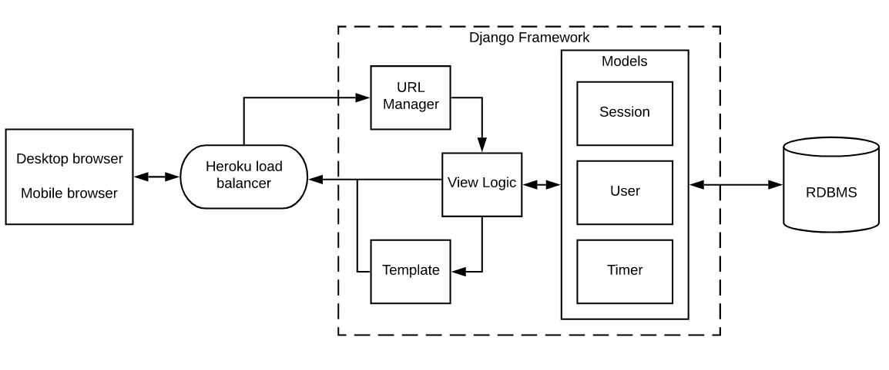

# pomodoro posse group
Pomodoro app project for CS361!

## Live Heroku site:
https://pomodoro-posse.herokuapp.com/

## High level architecture

## To run
1. Ensure that the secret key variable has been set on your local environment (shown in the "Setting SECRET_KEY environment variable" section below)
1. Navigate to the root directory of the project
1. Install dependencies with `$ pip install -r requirements.txt`
1. Generate database `$ python manage.py migrate`
1. Run `$ python3 manage.py runserver`

---

## Setting SECRET_KEY environment variable
### Generating secret keys
1. `$ python -m pip install Django`
1. `$ python3`
1. `from django.utils.crypto import get_random_string`
1. `chars = 'abcdefghijklmnopqrstuvwxyz0123456789!@#$%^&*(-_=+)'`
1. `SECRET_KEY = get_random_string(50, chars)`
1. `print(SECRET_KEY)`
1. `exit()`

### Add SECRET_KEY environment variable
#### bash/zsh(macOS)
1. Open terminal
2. `$ export SECRET_KEY='[value]'` (replacing [value] with the secret key you are using)

#### Windows 8/10
1. In Search, search for and then select: Edit environment variables for your account
1. In the User variables section, click New to open the New User Variable dialog box.
1. Enter 'SECRET_KEY' and its value, and click OK. The variable is added to the User variables section of the Environment Variables dialog box.
1. Click OK in the Environment Variables dialog box.

---
## Database
### Adding new database models
1. Add a class to the models.py file in the app
1. If the app is not already listed under the INSTALLED_APPS section of the settings.py file, add it there
1. `$ python3 manage.py makemigrations [app name]`
1. You should get an output siimlar to `[app name]/migrations/0003_auto_20200712_1548.py`
1. `$ python3 manage.py sqlmigrate [app name] [migration number]` (migration number in the above step is shown as '0003')
1. `$ python3 manage.py migrate`

### Updating existing database models
The below steps will need to be made in the Heroku CLI once the changes have been deployed to Heroku
1. `$ python3 manage.py makemigrations [app name]`
1. You should get an output siimlar to `[app name]/migrations/0003_auto_20200712_1548.py`
1. `$ python3 manage.py sqlmigrate [app name] [migration number]` (migration number in the above step is shown as '0003')
1. `$ python3 manage.py migrate`
1. If you were in the python shell when the updates were made, then run `exit()`

### Changing the name displayed for database model rows
1. Navigate to the models.py file in the app
1. Under the table (class) you would like to modify add a `def __str__(self):` function definition
1. In that function definition return the value that you would like to see. Example: `return self.username` 

---

### Interacting with data in tables from the terminal
You will always need to first run:

`$ python3 manage.py shell`

#### To import a table
`from [app name].models import [model name]`

#### To display data in table
Show all items: 

`[model name].objects.all()`

Display primary key for object: 

`[object name].pk` 

or 

`[object name].id`

#### To add data to a table
1. `[desired object name] = [model name]([attribute1]=[attribute1 value], [attribute2]=[attribute2 value], etc.)`
1. `[obect name from above step].save()`

---

### Admin panel
#### Creating a superuser
1. `$ python3 manage.py createsuperuser`
1. Press enter or type in a custom username and press enter
1. Enter your email
1. Enter a password to use for the account

#### Navigating to admin panel
1. `$ python3 manage.py runserver`
1. Navigate to 127.0.0.1:8000/admin
1. Enter the username and password used in the "Creating a superuser" step above

#### Adding models to admin panel
1. Navigate to the admin.py file of the app
1. Add import statement for the model you would like to add: `from .models import [model name]`
1. Add a line to register the model: `admin.site.register([model name])`

---

## Heroku
### Installing Heroku
1. Follow installation instructions here: https://devcenter.heroku.com/articles/heroku-cli#download-and-install

### Accessing the Heroku CLI
1. `$ heroku login`
1. `$ heroku run bash -a pomodoro-posse`

---

## Wireframes/Mockup
### Figma
Everyone should have edit access to the Figma project through their email they shared for calendar invitations. If you are not comfortable editing the wireframes let Mike know what you would like added or changed and he will do his best to incorporate your ideas.

https://www.figma.com/proto/ycNuRwDg2LLANTTFoCF0Tf/pomodoro?node-id=10%3A779&scaling=scale-down
