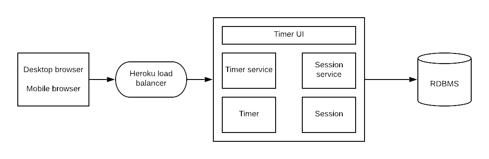

# pomodoro posse group
Pomodoro app project for CS361!

## High level architecture

## To run
1. Ensure that the secret key variable has been set on your local environment
1. Navigate to the root directory of the project
1. Run `python3 manage.py runserver`

---

## Setting environment variables

### Generating secret keys
1. `python -m pip install Django`
1. `python3`
1. `from django.utils.crypto import get_random_string`
1. `chars = 'abcdefghijklmnopqrstuvwxyz0123456789!@#$%^&*(-_=+)'`
1. `SECRET_KEY = get_random_string(50, chars)`
1. `print(SECRET_KEY)`

### bash/zsh(macOS)
1. Open terminal
2. Type in `export SECRET_KEY='value'` (replacing value with the secret key you are using)

### Windows 8/10
1. In Search, search for and then select: Edit environment variables for your account
1. In the User variables section, click New to open the New User Variable dialog box.
1. Enter 'SECRET_KEY' and its value, and click OK. The variable is added to the User variables section of the Environment Variables dialog box.
1. Click OK in the Environment Variables dialog box.
